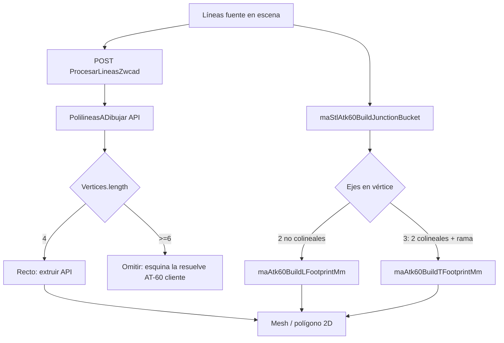

# AT-60 — Implementación en visor Desing_2 (handover técnico)

Última actualización: 2026-07-10

Documento para **agentes y desarrolladores** que continúen el encofrado AT-60 en el visor. Resume el **ciclo de vida líneas ↔ mallas**, la arquitectura de código, las fórmulas L/T ya cableadas y qué queda pendiente.

> Reglas de negocio y catálogo: [`ENCOFRADO-AT60-BASE.md`](ENCOFRADO-AT60-BASE.md)  
> Topología 2D T/+ y `WallConnections.json`: [`HANDOVER-MUROS-T-CRUCE.md`](HANDOVER-MUROS-T-CRUCE.md)  
> Modos visor y líneas fuente: [`HANDOVER-DESING2-MUROS-ARRANQUE.md`](HANDOVER-DESING2-MUROS-ARRANQUE.md)

---

## 1. Principio fundamental (leer primero)

En Desing_2 hay **dos capas** que no deben confundirse:

| Capa | Qué es | Persistencia | Atributos |
|------|--------|--------------|-----------|
| **Líneas fuente** | Ejes y caras dibujados por el usuario (`maStlUserLinesGroup`) | **Solo se borran al borrar el muro** (herramienta borrar / edición) | `numberOffsetMm` (mitad espesor E/2), `wallRole`, `wallGroupId`, cotas, etc. |
| **Modelo generado** | Polígonos 2D planos y mallas 3D extruidas | **Se borra al cambiar de modo** o al regenerar | `maStlWall3dGenerated`, `maStlAtk60FormworkMeta` |

### 1.1 La línea que se extruye es la que vale

- La **geometría de referencia** para espesor, uniones y encofrado es la **línea fuente** (eje + caras), no la malla provisional.
- Los atributos (`numberOffsetMm`, altura, sistema, etc.) viven en `userData.maStlUserPlanLine` de cada `Line2`.
- Al entrar en **Muro 2D** o **Muro 3D**:
  1. Las líneas fuente se **ocultan** (`maStlDesing2SetSourceLinesVisible(false)`).
  2. El modelo generado anterior se **elimina** (`maStlDesing2ClearGeneratedWallModels()`).
  3. Se **regenera** desde API + cliente (huellas AT-60 en nodos).
- Al volver a **Líneas**: se muestran las líneas fuente intactas; el modelo generado se limpia.

**Funciones clave del ciclo:**

```
maStlDesing2SetModelModeLines()     → modo líneas, clear generated, mostrar fuente
maStlDesing2ApplyWall2dModelMode()  → ocultar fuente, clear, API + AT-60 junctions 2D
maStlDesing2ApplyWall3dModelMode()  → ocultar fuente, clear, API rectos + AT-60 junctions 3D
maStlDesing2ClearGeneratedWallModels()
  ├── maStlWall2dModelClearGenerated()
  └── maStlWall3dModelClearGenerated()   // solo meshes con maStlWall3dGenerated
```

> **Cada sistema de encofrado es distinto.** AT-60 vive en `ma-stl-atk60-formwork.js`. Otro sistema (p. ej. futuro AT-90) debe tener **su propio módulo** con las mismas firmas de salida (`{ points, meta }`), no ramas `if (system === 'Atk-60')` dispersas en el visor.

---

## 2. Arquitectura de archivos

| Archivo | Responsabilidad |
|---------|-----------------|
| `Scripts/MasterArticles/ma-stl-atk60-formwork.js` | **Único lugar** con reglas AT-60: `maAtk60SelectPanelMm`, huellas L (6v) y T (8v) |
| `Scripts/MasterArticles/master-article-details-stl-viewer.js` | Orquestación: modos, API, bucket de nodos, render 2D/3D, **no** fórmulas de panel |
| `Services/LCornerDetector.cs` | API: muros rectos (4v) + esquina L genérica (6v) — **las esquinas API se ignoran en cliente** |
| `IA/Communication/WallConnections.json` | Debug topología (`junctionType`: L, T, Cross) |

### 2.1 Flujo de regeneración (Muro 2D / 3D)



### 2.3 Prioridad: caras fuente (JSON) sobre API

`LCornerDetector` agrupa esquinas donde **se cortan las caras** (p. ej. 19850 mm), no los nudos de eje del `WallConnections.json` (N2=T, N7/N8=L).

En el caso recinto + brazo horizontal:
- API devolvía 3 rectos + esquinas L en caras → **sin brazo izquierdo**, **sin T en N2**
- `wallJunctionDiagnostics` sí marca `N2: T`, `N7/N8: L`

**Regla actual:** `maStlDesing2BuildWallModelFromFaceStrips` genera primero desde pares cara+eje (`maStlWall2dModelCollectWallFaceStrips`), luego `maStlAtk60RenderJunctionFootprints*`. La API queda como fallback y diagnóstico en JSON.

Ejes con `lengthMm: 0` (p. ej. línea id 10 en JSON) se ignoran en strips y bucket de nodos.

`LCornerDetector` genera una esquina L **genérica** (hormigón arquitectónico) con espesor global. El encofrado AT-60 necesita:

- Esquina fija **0,30 m** en cada pata.
- Panel = `selectPanel(E + 0,30)` **por eje** (E puede diferir en cada pata).
- Metadatos `maStlAtk60FormworkMeta` (panel, taco madera).

Por eso:

- `maStlWall2dModelAddFlatPolylineDto` → `if (verts.length >= 6) return null`
- `maStlWall3dAddMeshesFromDetection` → `if (verts.length >= 6) continue`
- Tras los rectos API → `maStlAtk60RenderJunctionFootprints2d()` / `3d()`

---

## 3. Módulo `ma-stl-atk60-formwork.js`

### 3.1 Constantes

| Constante | Valor | Significado |
|-----------|-------|-------------|
| `MA_ATK60_CORNER_PANEL_MM` | 300 | Esquina fija 0,30 m |
| `MA_ATK60_MODULE_STEP_MM` | 150 | Paso catálogo 0,15 m |
| `MA_ATK60_MIN_PANEL_MM` | 300 | Panel mínimo P30 |

### 3.2 Selección de panel + taco madera

```javascript
needMm = necesidad geométrica (cualquier float, ej. 0,2345 + 0,30 = 534,5 mm)
panelMm = menor múltiplo de 150 desde 300 tal que panelMm >= needMm
woodTacoMm = panelMm - needMm
```

**Export:** `maAtk60SelectPanelMm(needMm)` → `{ needMm, panelMm, woodTacoMm }`

### 3.3 Esquina L — `maAtk60BuildLFootprintMm`

**Entrada:**

- `vertex` — nudo (mm escena)
- `d1`, `d2` — direcciones unitarias **hacia el cuerpo** de cada eje
- `e1Mm`, `e2Mm` — espesor **completo** por eje (`maStlWall2dModelAxisThicknessMm`)

**Fórmulas:**

```
leg1 = selectPanel(e1Mm + 0,30)
leg2 = selectPanel(e2Mm + 0,30)
```

**Salida:** polígono **6 vértices** CCW + `meta.kind: 'cornerL'`

**Caso validado (usuario):**

| E | Necesidad | Panel | Taco |
|---|-----------|-------|------|
| 0,2345 m (234,5 mm) | 0,5345 m | **0,60 m** | **0,0655 m** |

### 3.4 Unión T — `maAtk60BuildTFootprintMm`

> **Handover sesión 2026-07-10:** ver [HANDOVER-ENCOFRADO-AT60-SESION-T-2026-07-10.md](HANDOVER-ENCOFRADO-AT60-SESION-T-2026-07-10.md) (estado actual, P-1…P-8, flags, errores a no repetir).

**Entrada:**

- `throughAxisDir` — eje atravesado p1→p2 (para `u` y `nearSign`)
- `branchInto` — hacia cuerpo de la rama (`v`)
- `eThroughMm`, `eBranchMm` — espesores completos

**Fórmulas panel (cotas cian):**

| Cota | Necesidad |
|------|-----------|
| Ancho atravesado | `selectPanel(2 × E_atr)` |
| Vástago | `selectPanel(E_atr + 0,30)` |
| Luz interior | `selectPanel(2×0,30 + E_rama)` |
| Ancho rama | `selectPanel(E_rama)` |

**Salida:** polígono **8 vértices** CCW, etiquetas `P-1`…`P-8` en `meta.pointLabels`.

- Puntos conectados a muros rectos:
  - `P-1` / `P-2`: caras reales de la rama en el final recortado del recto rama.
  - `P-7` / `P-6`: cara near/far del recto atravesado izquierdo en su corte.
  - `P-4` / `P-5`: cara near/far del recto atravesado derecho en su corte.
- Puntos calculados:
  - `P-8`: intersección de la cara izquierda de la rama con la cara near del atravesado.
  - `P-3`: intersección de la cara derecha de la rama con la cara near del atravesado.
- Los puntos usan **caras reales** de los muros para conectar con rectos; las cotas de catálogo (`innerSpanPanelMm`, `branchPanelMm`, tacos) quedan en `meta` para acotación y futuro despiece.
- Recorrido: P-1 → P-8 → P-7 → P-6 → P-5 → P-4 → P-3 → P-2.

**Render actual:** `MA_STL_ATK60_T_EXTRUDE_3D = true` → en Muro 3D se extruye la huella T; la guía (`maStlAtk60AddTFootprintPointGuide`: contorno + puntos coloreados) se mantiene para depuración visual.

**Extrusión T:** `maStlWall3dAddMeshFromAtk60Footprint` crea `THREE.Shape` con `shape.moveTo(footprint.points[0])`; para T, `points[0]` es `P-1`. El bucle extruido sigue: `P-1 → P-8 → P-7 → P-6 → P-5 → P-4 → P-3 → P-2 → cierre`.

**Rectos en T:** `maStlAtk60BuildAxisEndpointTrimMap` + `maStlWall2dModelStripSquareCapAtAxisMm` (tapas ⊥ al eje).

### 3.5 Fix orientación T (2026-07-11)

**Síntoma reportado:** en algunos JSON de `WallConnections` la T aparecía "al revés" (rama/lados intercambiados visualmente según el orden interno de ejes).

**Causa técnica:** la orientación del atravesado en T dependía del sentido de un segmento (`p1→p2`) y del primer par detectado en bucles, lo que podía espejar la huella aunque la topología fuera válida.

**Corrección aplicada:**

- Nueva normalización de dirección en cliente: `maStlAtk60CanonicalThroughDirFromTJunction(intoA, intoB, branchInto)`.
- Regla: forzar una base canónica del atravesado para que la huella T no dependa del orden de líneas en el snapshot.
- Aplicado en:
  - cálculo de recortes de rectos (`maStlAtk60BuildAxisEndpointTrimMap`),
  - render 2D/3D de huella T (`maStlAtk60TryRenderJunctionAtBucket`),
  - generación de cotas AT-60 de T (`maStlAtk60CollectJunctionDimPlacements`).

**Resultado esperado:** geometría T estable (sin espejado espurio) entre nodos equivalentes y entre snapshots con distinto orden de segmentos.

**Incidencia corregida (mismo día):**

- Síntoma: desaparición de puntos guía `P-1..P-8` en algunos casos.
- Causa: mismatch de propiedades en la dirección canónica (`x/z` vs `ux/uz`) al invocar `maAtk60BuildTFootprintMm`.
- Fix: unificar a `x/z` en todas las llamadas que consumen `maStlAtk60CanonicalThroughDirFromTJunction`.

### 3.5 Clasificación por vértices

`maAtk60ClassifyFootprintKind(n)`:

- `n >= 8` → `cornerT`
- `n >= 6` → `cornerL`
- else → `wall`

---

## 4. Integración en `master-article-details-stl-viewer.js`

### 4.0 Estado operativo actual (2026-07-15)

#### Punto de insercion
- El punto de insercion final para ATK60 se calcula en backend (`Atk60WallsRepository`) y se consume en frontend solo para pintado.
- Regla aplicada: ancla en inicio explicito de muro + desplazamiento a cara exterior por normal de eje (`E/2`).
- Objetivo: evitar punto en centro de eje o interior de muro.

#### Fuente de datos de muro para encofrado
- Prioridad 1: muros 3D (`wallModelSource`, `_TypeMesh: Wall`).
- Fallback: ejes 3D de escena si la fuente de solidos no esta disponible.
- En `desing2-stl-viewer-toolbar-wiring.js`, `idsDetailed` reescribe atributos para C# con geometria 3D real (`Inicio*`, `Fin*`, `_Datalong`, `_DataWith`, `__Geom3D`).
- Longitud util: trim en extremos conectados (caso validado 9.70 -> 8.80).

#### JSON de auditoria de request
- El backend deja traza de request + muros normalizados + esquinas L/T/X/I en:
  - `C:\temp\Atk60RequestWallsDebug.json`

### 4.1 Espesor E por eje

```javascript
maStlWall2dModelAxisThicknessMm(axisUd)
  → maStlWall2dToolAxisHalfThicknessFromAxisUd(axisUd) * 2
  → lee numberOffsetMm de caras del eje, o espesor global herramienta muro
```

Permite **L asimétrica** (E distinto en cada pata) y **T** con espesores distintos atravesado/rama.

### 4.2 Bucket de nodos

`maStlAtk60BuildJunctionBucket()`:

- Recorre todos los ejes (`maStlWall2dToolCollectAllAxisLines`).
- Agrupa por vértice (`p1`/`p2`) con tolerancia `maStlWall2dToolJunctionClusterEpsMm()`.
- Cada bucket: `{ vertexMm, axes: [{ axisUd }] }`.

### 4.3 Render

| Función | Modo | Destino |
|---------|------|---------|
| `maStlAtk60RenderJunctionFootprints2d` | Muro 2D | `maStlWall2dModelAddAtk60Footprint2d` |
| `maStlAtk60RenderJunctionFootprints3d` | Muro 3D | `maStlWall3dAddMeshFromAtk60Footprint` (ExtrudeGeometry H=2700) |

**Metadatos en mesh:** `mesh.userData.maStlAtk60FormworkMeta` (paneles, tacos, E por eje).

### 4.4 Puntos de llamada (checklist)

- [x] `maStlDesing2ApplyWall2dModelMode` — tras API
- [x] `maStlDesing2ApplyWall3dModelMode` — tras API
- [x] `maStlWall2dModelRegenerateFromSourceLines` — tras tiras/caras y tras segmentos
- [x] Herramienta muro 3D (panel derecho) — tras `maStlWall3dAddMeshesFromDetection`
- [x] Skip esquinas API en 2D y 3D

### 4.6 Acotación AT-60 (botón `#ma-stl-tool-wall-dim`)

Al pulsar **Acotar muro**, además de longitudes/espesores arquitectónicos, se añaden cotas en nodos L/T:

| Tipo | `kind` | Color etiqueta | Qué mide |
|------|--------|----------------|----------|
| **Cateto** (panel) | `atk60-panel` | cian | `leg1PanelMm` / `leg2PanelMm` (L); atravesado, luz interior, vástago, rama (T) |
| **Remate** (taco madera) | `atk60-remate` | ámbar | Solo si `woodTacoMm ≥ 5` mm |

**Código:** `maStlAtk60CollectJunctionDimPlacements` → `maAtk60BuildFootprintDimPlacements` en `ma-stl-atk60-formwork.js`.

Las cotas se calculan desde **líneas fuente** (no requieren modo Muro 2D activo).

Reescrito para delegar en `maAtk60BuildLFootprintMm`. Se usa si algún flujo local invoca el grafo de nodos; el camino principal es `maStlAtk60RenderJunctionFootprints*`.

---

## 5. Estado por tipo de pieza

| Pieza | Líneas 2D | API recto | Huella AT-60 cliente | 3D extruido | STL catálogo |
|-------|-----------|-----------|----------------------|-------------|--------------|
| Muro recto | ✅ | ✅ 4v | 🔲 (usa API) | ✅ | 🔲 |
| Esquina L | ✅ caras | omitida ≥6v | ✅ 6v | ✅ | 🔲 |
| Unión T | ✅ caras | ❌ | ✅ 8v | ✅ | 🔲 |
| Cruce + | ✅ caras | ❌ | ❌ pendiente | ❌ | 🔲 |

---

## 6. Pruebas recomendadas (no automatizadas aún)

### 6.1 Esquina L

1. Dos ejes perpendiculares, E global 0,30 m → ambas patas: need 0,60 → panel 0,60, taco 0.
2. E global 0,2345 m → panel 0,60, taco 0,0655 en cada pata (si mismo E).
3. E distinto por eje: cambiar `numberOffsetMm` en caras de un solo muro → patas con paneles distintos.
4. Cambiar modo Líneas ↔ Muro 3D: líneas permanecen; mallas se regeneran.

### 6.2 Unión T

1. T perpendicular, Ortho F8, E_atr=0,45 m, E_rama=0,25 m → validar meta: through 900, stem 750, inner 900, branch 300.
2. E_rama distinto (0,40 m) → inner need 1,00 m → panel 1,05 m.
3. Comprobar que no aparece doble geometría (API corner + AT-60).
4. Regenerar con distintos órdenes de dibujo/segmentación y confirmar que la T no se invierte visualmente.
5. Validar casos con espesores distintos (`E_atr` vs `E_rama`) para confirmar ramas/cotas de catálogo.

### 6.3 Regresión

- Muro recto solo: sin nodos L/T, solo polígonos 4v API.
- `WallConnections.json`: `junctionType` coherente con piezas renderizadas.

---

## 7. Trabajo pendiente (orden sugerido)

1. **`maAtk60BuildCrossFootprintMm`** — cruce + (4 ejes); reglas en `HANDOVER-MUROS-T-CRUCE.md` §4.3.
2. **Descomposición rectos** en paneles P30…P90 a lo largo del eje (no solo huella en nudo).
3. **Sustitución STL** — enlazar `meta` con `Content/DesignTools/Stl/ATK60/`.
4. **`IEncofradoSystem`** — extraer interfaz común cuando exista segundo sistema.
5. **Tests visuales** — casos en `IA/Examples/` con capturas y `maStlAtk60FormworkMeta` esperado.
6. **Servidor** — opcional: ampliar `LCornerDetector` para T genérico si se quiere paridad sin cliente (hoy no necesario para AT-60).

---

## 8. Extender a otro sistema de encofrado

Plantilla para un agente futuro:

1. Crear `ma-stl-<sistema>-formwork.js` con:
   - Constantes de catálogo propias.
   - `selectPanel` o equivalente.
   - `buildLFootprintMm`, `buildTFootprintMm`, …
2. En visor: leer sistema activo del selector UI (`Atk-60` hoy).
3. Dispatcher fino:

```javascript
function maStlRenderJunctionFootprints2d(systemId) {
  if (systemId === 'Atk-60') return maStlAtk60RenderJunctionFootprints2d();
  // if (systemId === 'Otro') return maStlOtroRenderJunctionFootprints2d();
}
```

4. **No** copiar geometría AT-60 en otro sistema: esquina 0,30 y paso 0,15 son **solo AT-60**.

---

## 9. Referencia rápida de símbolos

| Símbolo JS | Significado |
|------------|-------------|
| `maStlUserPlanLine` | DTO en línea fuente |
| `numberOffsetMm` | Mitad espesor (E/2) en mm |
| `maStlWall3dGenerated` | Mesh provisional, se borra al cambiar modo |
| `maStlAtk60FormworkMeta` | Paneles/tacos AT-60 en userData |
| `wallRole: 'axis' \| 'face'` | Eje vs cara paralela |

---

## Changelog

| Fecha | Cambio |
|-------|--------|
| 2026-07-10 | Creación: ciclo líneas/mallas, módulo AT-60, L+T cliente, checklist pruebas, extensibilidad por sistema |
