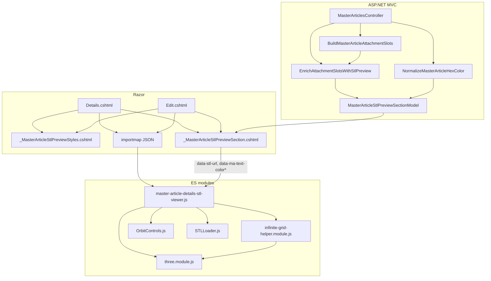

# ThreejsDesing — Visor STL Three.js (Master Articles)

Documentación de referencia para agentes y desarrolladores. Describe la implementación actual del visor STL en **Detalles** y **Editar** de Master Articles, con contrato DOM, API de arranque, lógica interna y guía para duplicar el módulo bajo el nombre **ThreejsDesing**.

---

## 1. Resumen y propósito

El visor muestra mallas **STL** exportadas desde bloques CAD (DWG u STL directo) en una tarjeta 3×3 (planta / elevaciones × filas 3D, mock-up, STL). El usuario elige un bloque con el botón naranja (ojo); el script carga el STL vía `STLLoader`, aplica colores del artículo (`TextColor1` / `TextColor2`), encuadra cámaras ortográficas sin recentrar geometría (inserción en origen mundo), y ofrece herramientas CAD: rejilla infinita, cielo, sombras en suelo, fondo negro, recortes por planos, cubo de vistas y pantalla completa.

**Punto de entrada actual:** `Scripts/MasterArticles/master-article-details-stl-viewer.js` (se ejecuta al cargar el módulo; no exporta símbolos).

**Objetivo futuro:** extraer o copiar este stack a `Scripts/ThreejsDesing/` con prefijos DOM/API propios, reutilizando Three.js del proyecto (`Scripts/Design/build/three.module.js`).

---

## 2. Diagrama de arquitectura



---

## 3. Inventario de archivos y dependencias

| Archivo | Rol |
|---------|-----|
| `Scripts/MasterArticles/master-article-details-stl-viewer.js` | Lógica Three.js, UI, carga STL |
| `Scripts/MasterArticles/infinite-grid-helper.module.js` | `InfiniteGridHelper` — rejilla shader en plano XZ |
| `Views/MasterArticles/_MasterArticleStlPreviewSection.cshtml` | Markup: tabla 3×3, toolbar, canvas, cubos, cortes |
| `Views/MasterArticles/_MasterArticleStlPreviewStyles.cshtml` | CSS del visor, cubo de vistas, cortes, fullscreen |
| `Models/MasterArticleDetailsViewModel.cs` | `MasterArticleStlPreviewSectionModel`, `MasterArticleAttachmentSlot` |
| `Controllers/MasterArticlesController.cs` | Slots, rutas STL, normalización hex |
| `Services/MasterArticleViewerDxfConverter.cs` | Resolución física `~/Files/MasterArticles/blocks/...` |
| `Scripts/Design/build/three.module.js` | Three.js (import map `three`) |
| `Scripts/Design/jsm/controls/OrbitControls.js` | `@masterarticles/OrbitControls` |
| `Scripts/Design/jsm/loaders/STLLoader.js` | `@masterarticles/STLLoader` |

### Import map (Details / Edit, solo si `HasStlPreview`)

```json
{
  "imports": {
    "three": "~/Scripts/Design/build/three.module.js",
    "@masterarticles/OrbitControls": "~/Scripts/Design/jsm/controls/OrbitControls.js",
    "@masterarticles/STLLoader": "~/Scripts/Design/jsm/loaders/STLLoader.js",
    "@masterarticles/InfiniteGridHelper": "~/Scripts/MasterArticles/infinite-grid-helper.module.js"
  }
}
```

Generado en Razor con `Newtonsoft.Json.JsonConvert.SerializeObject` y seguido de:

```html
<script type="module" src="~/Scripts/MasterArticles/master-article-details-stl-viewer.js"></script>
```

**Condición de carga:** al menos un slot con `StlPreviewExists == true` (`hasStlPreview` / `stlSection.HasStlPreview`).

---

## 4. Contrato DOM (IDs, clases, `data-*`)

### Contenedor y colores

| Selector | Atributos / notas |
|----------|-------------------|
| `#ma-stl-viewer-shell` | `data-ma-text-color1`, `data-ma-text-color2` — hex `#rgb` o `#rrggbb` para materiales primario/secundario |
| `#ma-stl-viewer-gl-host` | Host del `<canvas>` WebGL (vacío hasta boot) |
| `#master-article-details-stl-viewer-canvas` | Área canvas; clase `ma-stl-canvas--clips`; con cortes visibles: `ma-stl-canvas--clips-ui-visible` |
| `#master-article-details-stl-viewer-status` | Texto de estado (“Cargando…”, “Viendo: …”) |
| `#master-article-stl-viewer-toolbar` | Toolbar; oculta si no hay STL (`d-none`) |

### Botones de carga (tabla)

| Clase / atributo | Uso |
|------------------|-----|
| `.master-article-stl-load` | Click → `loadStl(url, label)` |
| `.master-article-stl-load.is-active` | Slot activo (borde en CSS) |
| `data-stl-url` | URL resuelta del STL (desde servidor) |
| `data-slot-label` | Etiqueta para mensaje de estado |
| `[disabled]` | Sin archivo o sin STL en disco — ignorado por el listener |

### Modo cámara (2D / 3D en UI)

| ID | `name` / `value` | Efecto |
|----|------------------|--------|
| `#ma-stl-cam-ortho` | `ma-stl-cam-mode` = `ortho` | Cámara ortográfica “planta/alzado” por defecto; cubo `#ma-stl-view-cube-ortho-wrap` |
| `#ma-stl-cam-iso` | `ma-stl-cam-mode` = `iso` | Segunda `OrthographicCamera` con vista inicial (1,1,1); cubo `#ma-stl-view-cube-iso-wrap` |

Ambos modos usan **proyección ortográfica** (no perspectiva). La etiqueta “isométrica” es modo de navegación/cubo distinto, no una `PerspectiveCamera`.

### Toolbar (IDs)

Ver sección 5.

### Recorte (clipping)

| ID | Rango | Semántica |
|----|-------|-----------|
| `#ma-stl-clip-toggle` | — | Muestra/oculta `#ma-stl-clip-controls` |
| `#ma-stl-clip-controls` | — | `d-none` por defecto |
| `#ma-stl-clip-y` | 0–1000, default 1000 | Corte en **altura** (plano mundo Y); 1000 = sin recorte |
| `#ma-stl-clip-x` | 0–1000, default 1000 | Corte en **planta** (eje X); slider horizontal invertido en CSS |

Fracción: `f = (1000 - v) / 1000` ∈ [0, 1]; `f = 0` sin recorte, `f = 1` máximo.

### Cubo de vistas (ortográfico)

| Atributo | Elementos | Acción |
|----------|-----------|--------|
| `data-ortho-view` | esquinas / aristas `.ma-stl-vc-corner`, `.ma-stl-vc-edge-*` | `applyOrthoDataView(key)` → `ORTHO_VIEW_DIR[key]` |
| `data-face` | `.ma-stl-vc-face-inside` (orto) o cara iso | Orto: `applyOrthoFaceToView(face)`; Iso: `applyIsoFaceToView(face)` |

Claves `data-ortho-view` (ej.): `front`, `top`, `front-top-left`, `top-back-right`, … — mapa completo en `ORTHO_VIEW_DIR` dentro del viewer JS.

### Cubo isométrico

`#ma-stl-view-cube-iso-wrap` — caras con `data-face` ∈ `front|back|top|bottom|left|right`; misma dirección ortogonal que en modo orto (`ORTHO_VIEW_DIR`).

---

## 5. Barra de herramientas — cada control

| ID | Icono (Remix) | Estado inicial | Función |
|----|---------------|----------------|---------|
| `#ma-stl-cam-ortho` / `#ma-stl-cam-iso` | layout / box-3 | `ortho` checked | `setCameraMode('ortho'|'iso')` — enlaza `OrbitControls` a la cámara activa; alterna cubos CSS |
| `#ma-stl-fullscreen-toggle` | fullscreen | off | Fullscreen API sobre `#ma-stl-viewer-shell`; redimensiona renderer en `fullscreenchange` |
| `#ma-stl-grid-toggle` | grid | off | `infiniteGrid.visible`; ajusta `uFwidthFloor` en `onBeforeRender` para líneas estables en orto |
| `#ma-stl-sky-toggle` | cloud | off | Gradiente canvas `createMasterArticleStlSkyBackgroundTexture()` + plano suelo `skyFloorPlane`; mutuamente compatible con fondo negro (cielo desactivado si negro) |
| `#ma-stl-ground-shadow-toggle` | shadow | off | `ShadowMaterial` en Y=0, `mainDirLight.castShadow`, `renderer.shadowMap.enabled`, mallas `castShadow`/`receiveShadow` |
| `#ma-stl-dark-bg-toggle` | moon | off | `scene.background` y `clearColor` negros; oculta suelo del cielo |
| `#ma-stl-clip-toggle` | scissors | off | Toggle panel `#ma-stl-clip-controls` y clase `ma-stl-canvas--clips-ui-visible` |

**No hay** botón de “capas” separado: la segunda malla es automática (`*2.stl`, ver §9).

---

## 6. API pública y arranque

### `bootMasterArticleDetailsStlViewer()`

- **Ubicación:** `master-article-details-stl-viewer.js`, función interna al módulo.
- **Invocación:** línea final `bootMasterArticleDetailsStlViewer();` — **auto-ejecución** al importar el módulo.
- **Precondición:** existe `#ma-stl-viewer-gl-host`; si no, sale sin error.
- **Exportaciones ES module:** ninguna (`export` no usado). Para reutilizar en ThreejsDesing, conviene extraer y `export { bootThreejsDesingViewer }` o similar.

### Contrato de integración en vista

1. `@Html.Partial("_MasterArticleStlPreviewStyles")` en `<head>` o inicio de vista.
2. `@Html.Partial("_MasterArticleStlPreviewSection", model)` con `MasterArticleStlPreviewSectionModel`.
3. Si `HasStlPreview`: `importmap` + `<script type="module" src="...viewer.js">`.

**Edit:** `ViewData["MasterArticleStlPreview"]` vía `PopulateMasterArticleStlPreviewViewData`.  
**Details:** `MasterArticleDetailsViewModel` con `AttachmentSlots`, `StlPreviewTextColor1Hex`, `StlPreviewTextColor2Hex`.

---

## 7. Funciones internas (agrupadas)

### Utilidades de módulo (top-level)

| Función | Descripción |
|---------|-------------|
| `createMasterArticleStlSkyBackgroundTexture()` | `CanvasTexture` gradiente cielo → horizonte blanco |
| `masterArticleStlWorldAxesLength(maxDim)` | Longitud ejes mundo: `clamp(maxDim * 0.2, 0.3, 1.0)` |
| `applyMasterArticleStlAxesStyle(axesRoot)` | Ejes semitransparentes, sin raycast |
| `disposeObject3D(obj)` | Libera geometría/materiales y quita de escena |
| `masterArticleStlTintColorFromDataHex(hexRaw)` | Parse `#rgb`/`#rrggbb` → `THREE.Color`; inválido → `#000000` |
| `masterArticleStlSecondaryUrlFromPrimary(primaryUrl)` | `foo.stl` → `foo2.stl` (antes de `.stl`, conserva query) |

### Dentro de `bootMasterArticleDetailsStlViewer`

#### Carga STL

| Función | Descripción |
|---------|-------------|
| `loadStl(url, label)` | `loadToken++`, dispose previo, `STLLoader.load`, mesh primario, `refitCamerasToObject`, `tryLoadSecondaryStl` |
| `tryLoadSecondaryStl(primaryUrl, group, myToken, loader)` | `fetch` a URL `*2.stl`; 404 silencioso; material `TextColor2` |
| `makeStlMeshStandardMaterial(tintColor)` | `MeshStandardMaterial` + `clippingPlanes` + `clipShadows` |

**Transformación CAD → Three:** `mesh.rotation.x = -Math.PI / 2` (planta CAD en XY → Y arriba en Three). **No** se llama `geometry.center()` — vértices y origen de inserción se respetan.

#### Materiales y colores

- Primario: `data-ma-text-color1` → `stlMeshTintColor`.
- Secundario: `data-ma-text-color2` → `stlMeshTintColor2` en malla `*2.stl`.

#### Cámaras y modos

| Función | Descripción |
|---------|-------------|
| `makeOrthoCamera()` | `OrthographicCamera` con `frustumHalfY` y `lastAspect` |
| `activeCamera()` | `cameraIso` si `activeMode === 'iso'`, si no `cameraOrtho` |
| `setCameraMode(mode)` | Cambia `activeMode`, `bindControls`, radios, cubos |
| `placeCamerasForModel(maxDim)` | Orto: (0,0,d) mira origen; Iso: dirección (1,1,1) normalizada |
| `refitCamerasToObject(group)` | AABB + extensión desde origen (`masterArticleStlFitMaxDimFromWorldBox`), frustum, rejilla, sombras, clip bounds, ejes |
| `masterArticleStlFitMaxDimFromWorldBox(box)` | `max(arista AABB, span desde (0,0,0))` — encuadre sin centrar mesh |
| `applyFrustumToCamera` / `applyFrustumToBoth` | Actualiza left/right/top/bottom |
| `applyDirectionToOrthoCam(camera, dir)` | Posiciona cámara en `dir * viewDistanceFromModel()`, `lookAt(0,0,0)` |
| `applyOrthoDataView` / `applyOrthoFaceToView` | Vistas desde cubo orto |
| `applyIsoFaceToView` | Modo iso + misma dirección que `ORTHO_VIEW_DIR[face]` |

#### OrbitControls

| Función | Descripción |
|---------|-------------|
| `bindControls(camera)` | Nuevo `OrbitControls`, damping, target (0,0,0) |
| `stlOrbitPointerDownWillRotate(ev)` | Detecta si el gesto rotará (botón izquierdo) |
| `onCanvasPointerDownSetOrbitPivot(ev)` | Raycast al STL → `controls.target` en punto bajo cursor (fase capture) |

#### Cubo de vistas (CSS)

| Función | Descripción |
|---------|-------------|
| `getCameraCssMatrix3d(matrix)` | `matrix3d` con negaciones en columna Y (como `Design-3d-three.js`) |
| `setViewCubeCssFromCamera(cubeEl, camera)` | Sincroniza rotación del cubo HTML cada frame |
| `syncViewCubesVisibility()` | Muestra orto o iso wrap según `activeMode` |

#### Recorte (clipping planes)

| Función | Descripción |
|---------|-------------|
| `clipFractionFromSlider(inputEl)` | `(1000 - value) / 1000` |
| `updateClipPlanes()` | Planos mundo Y y X sobre AABB + padding; asigna a `clipStlMeshes[].material.clippingPlanes` |
| `syncClipToggleUi()` | Panel y `aria-pressed` |

`renderer.localClippingEnabled = true`.

#### Sombras, rejilla, cielo

| Función | Descripción |
|---------|-------------|
| `syncGridToggleUi` | Visibilidad `InfiniteGridHelper` |
| `syncSkyToggleUi` / `applySceneBackgroundAndClearColor` | Cielo / blanco / negro |
| `syncDarkBgToggleUi` | Fondo negro |
| `syncGroundShadowToggleUi` | Plano sombra + luz direccional |

#### Render loop y layout

| Función | Descripción |
|---------|-------------|
| `tick()` | `requestAnimationFrame`, `controls.update`, cubos CSS, `renderer.render(scene, activeCamera())` |
| `resizeRendererToHost()` | Tamaño desde `#ma-stl-viewer-gl-host`, actualiza aspect y frustum |
| `setStatus(text)` | Texto en barra de estado |
| `syncFullscreenToggleUi` | Icono y `aria-pressed` fullscreen |

---

## 8. Lado servidor

### Rejilla de 9 slots (`BuildMasterArticleAttachmentSlots`)

Orden fijo (índice `r * 3 + c` en la vista):

| Fila | Col 0 | Col 1 | Col 2 |
|------|-------|-------|-------|
| 3D | Planta 3D | Elev. vertical 3D | Elev. horizontal 3D |
| mock-up | Planta mock-up | Elev. vertical mock-up | Elev. horizontal mock-up |
| STL | Planta STL | Elev. vertical STL | Elev. horizontal STL |

Propiedades entidad: `LinkBlockDwgPlant3D`, `LinkBlockDwgVerticalElevation3D`, …, `LinkBlockDwgHorizontalElevationStl`.

`ViewerKind`: `none` | `dwg` | `stl` | `dxf` (por extensión).

### Rutas virtuales y STL en visor (`EnrichAttachmentSlotsWithStlPreview`)

- **Slot DWG:** `StlPreviewVirtualPath = Path.ChangeExtension(dwgV, ".stl")`.  
  `StlPreviewExists` si existe el `.stl` físico junto al DWG resuelto (`TryMapAppRelativeDwgToPhysical` + `File.Exists`).
- **Slot STL:** `StlPreviewVirtualPath =` ruta del adjunto; existe si `TryMapAppRelativeStlToPhysical`.

Rutas típicas: `~/Files/MasterArticles/blocks/{nombre}.dwg` y `~/Files/MasterArticles/blocks/{nombre}.stl` (también legado `blocks/{articleId}/` — ver `MasterArticleViewerDxfConverter`).

### Colores hex (`NormalizeMasterArticleHexColor`)

- Vacío → `#000000`.
- Trim + recorte longitud: **TextColor1** max 200, **TextColor2** max 10 (al guardar Create/Edit).
- La vista emite el valor en `data-ma-text-color1/2`; el JS acepta solo `#rgb` o `#rrggbb` (otros formatos → negro en cliente).

### Modelos Razor

- `MasterArticleStlPreviewSectionModel`: slots + `TextColor1Hex` / `TextColor2Hex` + `HasStlPreview`.
- `MasterArticleDetailsViewModel`: mismos slots + `StlPreviewTextColor1Hex` / `StlPreviewTextColor2Hex` para Details.

---

## 9. Convenciones de nombres de archivo

| Patrón | Ejemplo | Uso |
|--------|---------|-----|
| DWG → STL mismo base | `27104219P.dwg` → `27104219P.stl` | Preview en slot DWG |
| STL secundario | `27104219P.stl` → `27104219P2.stl` | Segunda malla automática (`masterArticleStlSecondaryUrlFromPrimary`) |
| Color 1 / 2 | `TextColor1` / `TextColor2` en BD | Materiales primario y secundario |

El sufijo `2` se inserta **inmediatamente antes** de `.stl` (no confundir con `27104219P-2.stl`).

---

## 10. InfiniteGridHelper

Constructor en viewer: `new InfiniteGridHelper(8, 32, color, 500, 2.55, 0.56)` — celdas escaladas en `refitCamerasToObject` (`uSize1 = maxDim/16`, `uSize2 = maxDim/4`, `uDistance = maxDim * 100`).

Plano XZ, shader con `fwidth` y `uFwidthFloor` para cámaras ortográficas. `renderOrder = -10`, `depthWrite: false`.

---

## 11. Duplicar como ThreejsDesing — checklist

1. **Copiar/adaptar JS**
   - [ ] `master-article-details-stl-viewer.js` → p. ej. `Scripts/ThreejsDesing/threejs-desing-viewer.js`
   - [ ] `infinite-grid-helper.module.js` (o import compartido desde `MasterArticles`)
   - [ ] Renombrar prefijo DOM `ma-stl-*` → `td-*` (o convención acordada) de forma **consistente** en JS, CSHTML y CSS

2. **Vistas**
   - [ ] Partials `_ThreejsDesingSection.cshtml` / `_ThreejsDesingStyles.cshtml` (desde `_MasterArticleStlPreview*`)
   - [ ] ViewModel dedicado si la fuente de datos no es Master Articles

3. **Import map**
   - [ ] Nuevo alias `@threejsdesing/...` para no colisionar con `@masterarticles/`
   - [ ] Misma ruta `three.module.js` del build Design

4. **Servidor**
   - [ ] Endpoints o ViewData que rellenen slots, `data-stl-url`, colores hex
   - [ ] Misma lógica DWG→STL y existencia en disco si aplica

5. **Proyecto**
   - [ ] `<Content Include="Scripts\ThreejsDesing\...">` en `Design.csproj`
   - [ ] Documentar en este README cambios de contrato

6. **API modular**
   - [ ] Sustituir auto-ejecución por `export function bootThreejsDesingViewer(options)` con selectors configurables
   - [ ] Opcional: no cargar script hasta que el usuario abra el visor

7. **Pruebas manuales**
   - [ ] Carga primario + `*2.stl`
   - [ ] Modos orto/iso, cubo, orbit pivot, fullscreen, resize
   - [ ] Grid, cielo, sombra, fondo negro, cortes X/Y
   - [ ] Origen (0,0,0) visible — modelo no debe “saltar” al centrar

---

## 12. Constantes y detalles útiles

| Constante | Valor / nota |
|-----------|----------------|
| `MA_STL_SKY_HORIZON_HEX` | `0xffffff` |
| `MA_STL_AXES_VISIBLE` | `true`, opacidad `0.42` |
| Rotación mesh | `-π/2` en X |
| `loadToken` | Invalida callbacks asíncronos al cambiar de STL |
| Tone mapping | `ACESFilmicToneMapping`, exposure `1.05` |
| Cubo CSS `VC_CSS_TZ` | `-384` |

---

## 13. Referencias cruzadas en código

- Encuadre sin `center()`: comentario en `loadStl` y `masterArticleStlFitMaxDimFromWorldBox`.
- Alineación con DesignTools: `ORTHO_VIEW_DIR`, `getCameraCssMatrix3d` ↔ `Design-3d-three.js`.
- Estilos fullscreen: `#ma-stl-viewer-shell:fullscreen` en `_MasterArticleStlPreviewStyles.cshtml`.

---

*Última revisión: alineada con `master-article-details-stl-viewer.js` (~970 líneas) y partials Master Articles en el repo Desing.*
